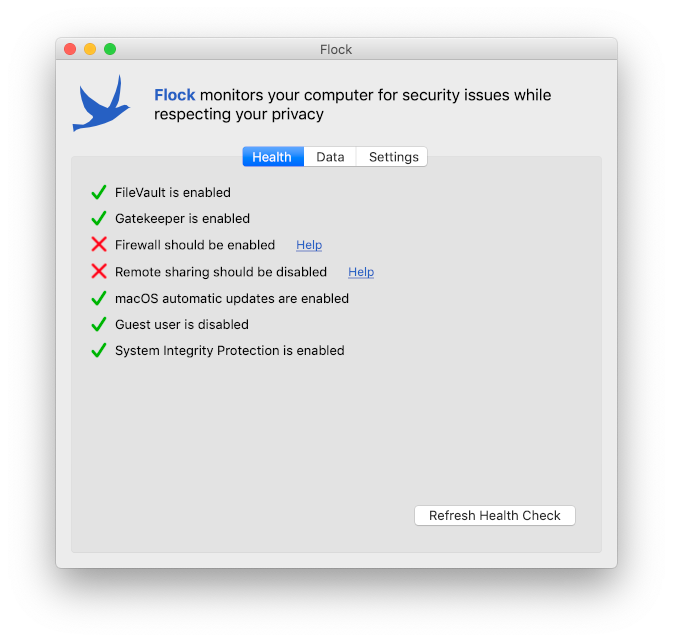
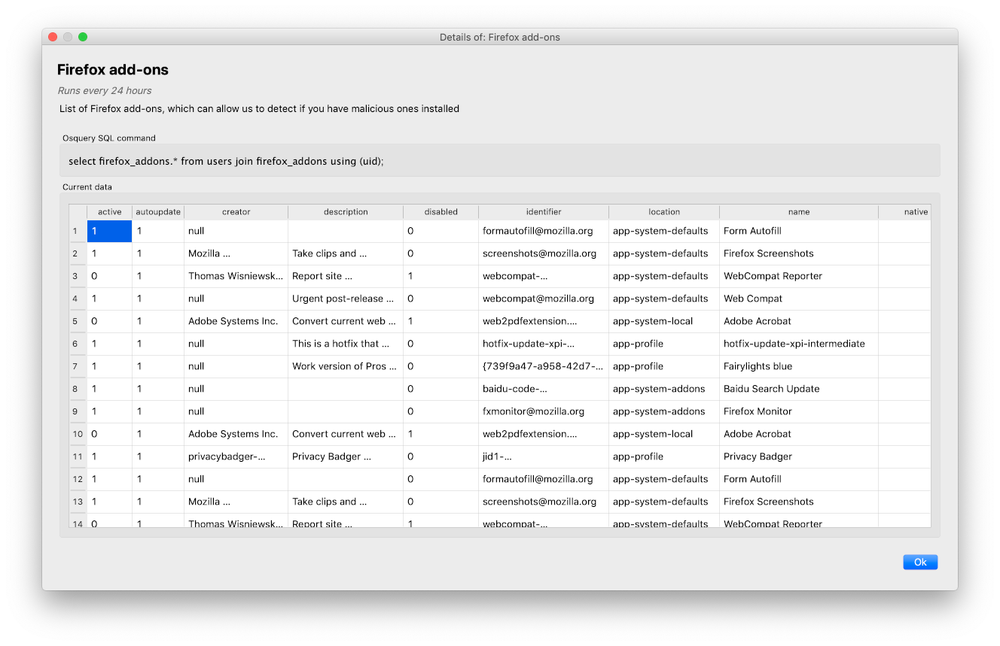

# Flock Agent

_**⚠️ This software is under development. It's not ready to be used in production.**_

Flock is a privacy-preserving fleet management system. The goal of Flock is to gain visibility into a fleet of laptops while protecting the privacy of the laptop users. It achieves this by only collecting information needed to inform security decisions, and by not allowing the IT team to access arbitrary files or execute arbitrary code on the laptops they are monitoring.

This is the macOS agent that runs on endpoints, collects data, and shares it with the [Flock server](https://github.com/firstlookmedia/flock).

### Health check

The agent lets users quickly check on the security best practices of their Mac. If any best practice isn't being followed, the user can click "Help" to load a wiki page with instructions for hardening their system.



### Data collection

The agent collects specific pieces of data that are helpful for the organization to assess their security posture and detect attacks. Users can choose not to opt-in to any of these types of data if they wish.


Users can click "Details" next to any type of data to see exactly what data is collected from their computer, how frequently, and what the osquery SQL query being run is.



## Installing Flock Agent

First [install Homebrew](https://brew.sh/), if you don't already have it. Then open the Terminal app and run:

```sh
# Install dependencies
brew cask install java
brew install osquery

# Add the First Look Media tap
brew tap firstlookmedia/homebrew-firstlookmedia

# Install Flock Agent
brew cask install flock-agent
```

Then launch Flock from `/Applications`.

## About Flock Agent

Flock Agent is GUI app for macOS that lives in your system tray, monitors your computer, and submits data to a Flock server. Here are some features:

- Users install Flock Agent using [Homebrew](https://brew.sh/).
- Flock Agent installs its own dependencies (like [osquery](https://osquery.io/)) using Homebrew, and also automatically keeps your Homebrew packages up-to-date.
- Flock Agent has a "health check", allowing users to assess the security health of their computer, and help them start using best practices.
- Flock Agent includes "twigs", osquery SQL queries that get run at regular intervals and send the results to the server. (You know, because birds collect twigs and bring them back to their server.) The twigs focus on security-related information, such as what versions of what software is installed, and what processes launch automatically. You can [see all included twigs here](./flock_agent/twigs.py).
- Before Flock Agent shares any data with the server, users must opt-in. Or, they can choose to always automatically opt-in to sending data, but the choice is with the user. Users can view exactly what data is collected for each twig before deciding to opt-in.

After launching Flock Agent for the first time, you need to register it with a Flock server, which just requires knowing the gateway URL of the server.

## Advanced usage

If you'd like to see what Flock Agent is doing as it's doing it, you can open it in verbose mode. First, click the Flock icon in the system tray, switch to the Settings tab, and click "Quit Flock Agent". Then open the Terminal app and run:

```sh
/Applications/Flock.app/Contents/MacOS/flock-agent -v
```

This will output verbose information in the Terminal about what Flock Agent is doing.

## Building from source

Follow the [instructions here](/BUILD.md) run Flock Agent from the source tree.
